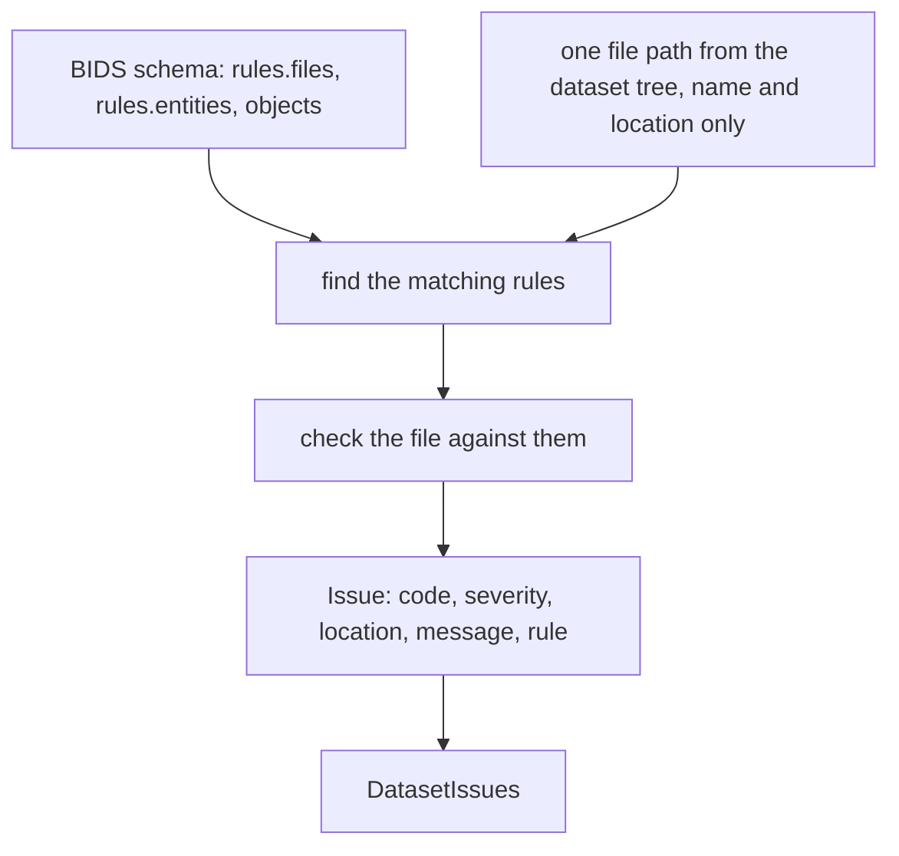
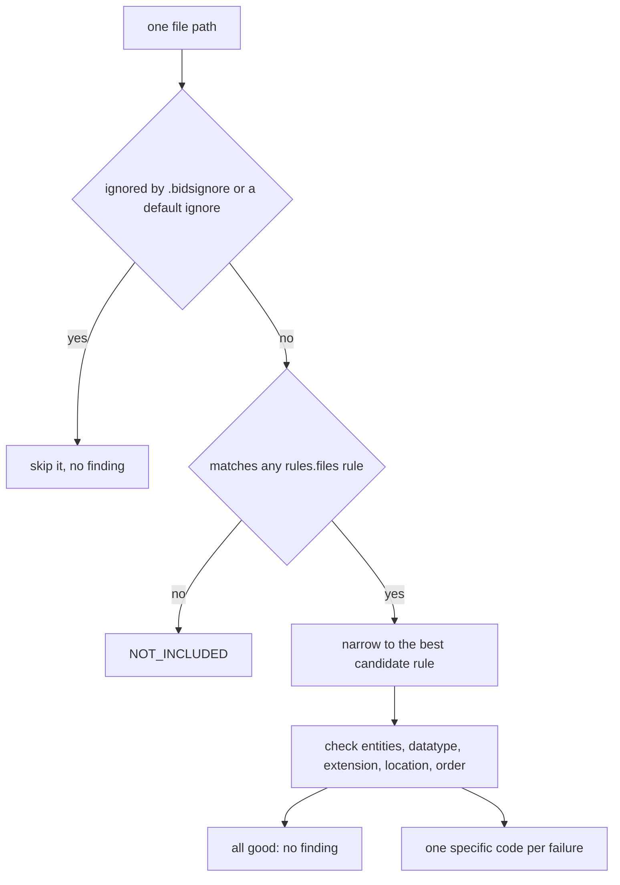
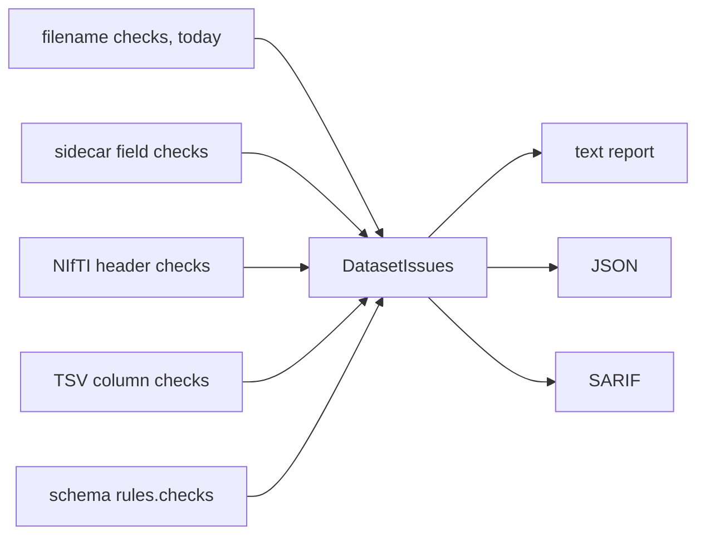

# The filename issues module

Two new modules turn filename checking into structured, machine-readable findings:

| Module | Role |
|---|---|
| `bids_validator.issues` | The **container**: what a finding is. Pure data, no I/O. |
| `bids_validator.filename_checks` | The **logic**: schema-driven filename and path checks. |

Scope: names and paths only. Nothing here opens a file or reads its contents.

## What this adds

Before, the filename check answered a yes/no question. `BIDSValidator.is_bids(path)`
returned a boolean, and the command line printed a line per bad file:

```
/sub-01/anat/oops.nii.gz is not a valid bids filename
```

That output cannot tell you *why* the name is wrong, cannot be counted or filtered,
and cannot be consumed by another program.

Now each problem is a typed `Issue` with a specific code:

```
[error] DATATYPE_MISMATCH
    file   : sub-01/func/sub-01_T1w.nii.gz
    detail : the file is in 'func' but its suffix belongs in: anat
    rule   : rules.files.raw.anat.nonparametric
```

The finding says which rule was applied and what exactly failed, and it serialises
straight to JSON.

## Architecture

The BIDS schema describes every legal filename: which suffix belongs in which
datatype folder, which entities are required or allowed, which extensions are
permitted. The module reads those rules rather than hardcoding BIDS knowledge.



For one file the flow is:



Default ignores mirror the reference TypeScript validator: `.git**`, `.*`,
`sourcedata/`, `code/`, `stimuli/`, `log/`. Directory recordings such as CTF `.ds`
are treated as single units and are not name-checked inside.

### Where the codes come from

Schema-defined `rules.checks` carry their own issue code, but the structural
filename failures do not exist in the schema. Their codes come from the reference
TypeScript validator's catalog (`src/issues/list.ts`). `filename_checks.FILENAME_ISSUES`
mirrors that catalog so the provenance is explicit and the output stays
interchangeable with the reference.

## The issue codes

All ten are errors. The reference defines no filename warnings.

| Code | Raised when |
|---|---|
| `NOT_INCLUDED` | the name matches no BIDS rule at all |
| `MISSING_REQUIRED_ENTITY` | a required entity for that suffix is absent |
| `ENTITY_NOT_IN_RULE` | an entity is not allowed for that suffix |
| `ENTITY_WITH_NO_LABEL` | an entity has no label, such as `acq-` |
| `INVALID_ENTITY_LABEL` | a label breaks the schema's format pattern |
| `EXTENSION_MISMATCH` | the extension is not allowed for that suffix |
| `DATATYPE_MISMATCH` | the datatype folder does not match the suffix |
| `INVALID_LOCATION` | a valid name in the wrong directory, or a data file outside any datatype directory |
| `FILENAME_MISMATCH` | entities duplicated or out of canonical order |
| `ALL_FILENAME_RULES_HAVE_ISSUES` | several rules matched and each had a problem |

## One deliberate difference from the reference validator

The module is stricter in exactly one place: **a data file that is not inside a
recognised datatype directory**.

```
sub-01/foo/sub-01_T1w.nii.gz     a folder that is not a datatype
sub-01/sub-01_T1w.nii.gz         no datatype folder at all
```

The reference TypeScript validator does not report these. Its suffix matching
ignores the datatype, so the T1w rule still matches, and its `DATATYPE_MISMATCH`
check is then skipped because the parent directory is not a known datatype
(`findDatatype` returns an empty string, and the check is gated on that value being
truthy).

The legacy `BIDSValidator.is_bids` does report them, because its regexes cover the
whole path including the datatype directory. Since this module replaces that check,
dropping the case would lose coverage users already have, so it is reported as
`INVALID_LOCATION`, whose catalog reason is exactly "The file has a valid name, but
is located in an invalid directory."

Metadata files are exempt. The inheritance principle lets a `.json` or `.tsv` sit
higher in the tree than the data it describes, so `sub-01/sub-01_T1w.json` and
`task-rest_bold.json` at the dataset root are correct and are not flagged. The
exempt extensions are in `INHERITABLE_EXTENSIONS`.

Everything else matches the reference exactly.

## How to use it

### On your own dataset

```python
from bidsschematools.schema import load_schema

from bids_validator.filename_checks import collect_filename_issues
from bids_validator.types.files import FileTree

tree = FileTree.read_from_filesystem('/path/to/dataset')
issues = collect_filename_issues(tree, load_schema())

print(len(issues), 'finding(s)')
for issue in issues:
    print(issue.code, issue.location, issue.message)

if issues.has_errors:
    raise SystemExit(1)
```

`DatasetIssues` supports `len()`, iteration, `has_errors`, and
`by_severity(Severity.ERROR)`. Each `Issue` converts to a plain dict with
`attrs.asdict(issue)`, so a JSON report is one line:

```python
import json

import attrs

print(json.dumps([attrs.asdict(issue) for issue in issues], indent=2))
```

The example script accepts a dataset path, so you can run it directly:

```shell
python docs/example_filename_issues.py /path/to/dataset
```

### The generated example

Run it with no argument to build a small dataset containing one deliberately
broken file per issue code, then validate it:

```shell
python docs/example_filename_issues.py
```

The dataset it generates:

| File | Raises |
|---|---|
| `sub-01/notes.txt` | `NOT_INCLUDED` |
| `sub-01/anat/sub-01_T1w.txt` | `EXTENSION_MISMATCH` |
| `sub-01/func/sub-01_bold.nii.gz` | `MISSING_REQUIRED_ENTITY` |
| `sub-01/anat/sub-01_acq-_T1w.nii.gz` | `ENTITY_WITH_NO_LABEL` |
| `sub-01/anat/sub-01_acq-a!b_T1w.nii.gz` | `INVALID_ENTITY_LABEL` |
| `sub-01/anat/sub-01_dir-AP_T1w.nii.gz` | `ENTITY_NOT_IN_RULE` |
| `sub-01/anat/acq-x_sub-01_T1w.nii.gz` | `FILENAME_MISMATCH` |
| `sub-01/func/sub-01_T1w.nii.gz` | `DATATYPE_MISMATCH` |
| `sub-02/anat/sub-01_T1w.nii.gz` | `INVALID_LOCATION` |
| `sub-01/sub-01_channels.tsv` | `ALL_FILENAME_RULES_HAVE_ISSUES` |

It also contains correctly named files (`sub-01/anat/sub-01_T1w.nii.gz`,
`sub-01/func/sub-01_task-rest_bold.nii.gz`, `README`) which produce no findings.

Part of the real output:

```
10 finding(s): 10 error(s), 0 warning(s)

[error] EXTENSION_MISMATCH
    file   : sub-01/anat/sub-01_T1w.txt
    detail : extension '.txt' is not allowed here; allowed: .nii.gz, .nii, .json
    rule   : rules.files.raw.anat.nonparametric
[error] MISSING_REQUIRED_ENTITY
    file   : sub-01/func/sub-01_bold.nii.gz
    detail : missing required entities: task
    rule   : rules.files.raw.func.func
[error] FILENAME_MISMATCH
    file   : sub-01/anat/acq-x_sub-01_T1w.nii.gz
    detail : expected filename: sub-01_acq-x_T1w.nii.gz
```

## Extending this to file contents

The issues layer is deliberately generic. An `Issue` does not know what kind of
check produced it, so content validation plugs in without changing anything here.
A content check reads a file and emits the same `Issue` type into the same
`DatasetIssues`:

```python
def sidecar_checks(context) -> list[Issue]:
    """Check the fields inside a JSON sidecar."""
    issues = []
    if 'RepetitionTime' not in context.sidecar:
        issues.append(
            Issue(
                code='SIDECAR_KEY_REQUIRED',
                location=context.file.relative_path,
                message='RepetitionTime is required for this file',
            )
        )
    return issues
```

Different codes, one shape:



Three things make the extension straightforward:

1. **The container does not change.** `Issue` and `DatasetIssues` already carry
   everything a content finding needs, including `rule` for schema-driven checks.
2. **The context is the natural input.** `Context` already exposes the lazily
   loaded contents (`json`, `columns`, `nifti_header`, `sidecar`), so a content
   check reads from the same object the filename checks use.
3. **Codes for content checks mostly come from the schema.** Schema-defined
   `rules.checks` carry their own `issue` block with a code, level, and message, so
   a rule engine can build an `Issue` straight from the schema rather than
   hardcoding a catalog.

The pattern to follow is the one in `filename_checks.py`: a function that takes a
`Context`, returns a `list[Issue]`, and never raises for a file it cannot judge.
Skipping an undeterminable check keeps the validator free of false alarms.

---

# Technical reference

Everything a developer needs to work on these two modules: the types, the call
graph, and the reason behind each decision.

## Files

| File | Role |
|---|---|
| `src/bids_validator/issues.py` | The finding model. Pure data, no imports from the rest of the package. |
| `src/bids_validator/filename_checks.py` | The check logic. Reads the schema, walks the tree, emits findings. |
| `tests/test_issues.py` | Model unit tests. |
| `tests/test_filename_checks.py` | One test per issue code, plus ignore and catalog tests. |
| `docs/example_filename_issues.py` | Runnable example, both modes. |

## `bids_validator.issues`

### `Severity(str, Enum)`

```python
class Severity(str, Enum):
    WARNING = 'warning'
    ERROR = 'error'
```

Subclassing `str` as well as `Enum` means a member *is* a string, so
`attrs.asdict` and `json.dumps` produce `"error"` with no custom encoder and no
`.value` calls at the serialisation boundary. Only two members exist because the
reference validator defines no third level for filename findings; adding one later
does not change any call site.

### `Issue`

```python
@attrs.define(kw_only=True)
class Issue:
    code: str
    severity: Severity = Severity.ERROR
    location: str | None = None
    message: str | None = None
    sub_code: str | None = None
    rule: str | None = None
```

| Field | Purpose |
|---|---|
| `code` | Stable identifier, the thing tools key on. The only required field. |
| `severity` | Defaults to `ERROR`, which is correct for every filename finding. |
| `location` | Dataset-relative path, taken from `FileTree.relative_path`. |
| `message` | Human-readable detail, the reference validator's `issueMessage`. |
| `sub_code` | Finer category within a code, for example which entity was at fault. |
| `rule` | Dotted schema path of the rule that fired, for example `rules.files.raw.anat.nonparametric`. |

`attrs` rather than `pydantic` or `msgspec` because `attrs` is what the rest of the
package already uses (`context.py`, `types/files.py`, `bidsignore.py`); a second
data library would be a new dependency and an inconsistency. `kw_only=True` forces
call sites to name their fields, so an `Issue(...)` literal reads as documentation
and adding a field can never silently shift a positional argument.

`rule` is populated only by the checks that are scoped to one matched rule
(`MISSING_REQUIRED_ENTITY`, `ENTITY_NOT_IN_RULE`, `DATATYPE_MISMATCH`,
`EXTENSION_MISMATCH`). Whole-file findings such as `NOT_INCLUDED` leave it `None`,
because no single rule produced them.

### `DatasetIssues`

```python
@attrs.define
class DatasetIssues:
    issues: list[Issue] = attrs.field(factory=list)
```

| Member | Purpose |
|---|---|
| `add(issue)` | Append one finding. |
| `extend(issues)` | Append many, used by the per-file loop. |
| `by_severity(severity)` | Filter, preserving insertion order. |
| `has_errors` | Property. Drives the process exit code. |
| `__len__`, `__iter__` | Makes it behave like a collection at call sites. |

A wrapper rather than a bare `list[Issue]` so that later additions (grouping,
severity rollup, a summary view) do not force every caller to change. `factory=list`
gives each instance its own list; a bare `= []` default would be shared across all
instances.

## `bids_validator.filename_checks`

### Public API

| Name | Signature | Notes |
|---|---|---|
| `collect_filename_issues` | `(tree: FileTree, schema: Namespace) -> DatasetIssues` | The front door. Builds the `Dataset`, walks, collects. |
| `iter_contexts` | `(dataset: Dataset, ignore: HasMatch \| None = None) -> Iterator[Context]` | Yields one `Context` per validatable file. A generator, so memory stays flat on large datasets. |
| `build_ignore` | `(tree: FileTree) -> IgnoreMany` | The defaults plus the dataset's `.bidsignore`. |
| `filename_issues` | `(context: Context) -> list[Issue]` | All findings for one file. The unit a future rule engine would call. |
| `DEFAULT_IGNORES` | `tuple[str, ...]` | Mirrors the reference validator's `defaultIgnores`. |
| `FILENAME_ISSUES` | `dict[str, str]` | The ten codes with the reference's reason text. |

`filename_issues` takes a `Context` and returns a list rather than mutating a
collection. That keeps it pure and independently testable, and it is the same shape
a content check will have, so the two compose without adapters.

### Internals: rule identification

| Function | What it does and why |
|---|---|
| `_file_rules(schema)` | Flattens `rules.files` into `[(dotted_path, leaf_rule)]`. The schema nests rules several levels deep; flattening once makes matching a simple loop and gives every finding a printable rule path. |
| `_collect(node, path, out)` | The recursive walk behind it. A node is a leaf when it has `path`, `stem`, or `suffixes`. |
| `_find_rule_matches(schema, context)` | Every rule the file matches. Skips `rules.files.deriv*` unless `DatasetType` is `derivative`, otherwise derivative-only patterns would validate raw files. |
| `_rule_matches(node, context)` | Three ways a rule can match: an exact `path`, a `stem` glob, or membership in `suffixes`. |
| `_match_stem(node, context)` | `fnmatch.fnmatchcase` for the glob, plus a datatype constraint when the rule has one. Case-sensitive because BIDS names are. |
| `_narrow(schema, context, matched)` | Several rules can match one name. Prefer those sharing the file's datatype, then those whose entities and extension fit. Without this a file would be judged against an unrelated rule and produce misleading codes. |
| `_entities_extensions_fit(...)` | The second narrowing test: the extension is allowed and the file's entities are a subset of the rule's. |

### Internals: per-file checks

Each returns `list[Issue]`, so `filename_issues` is a concatenation.

| Function | Emits |
|---|---|
| `_missing_label(context, matched)` | `ENTITY_WITH_NO_LABEL` for entities whose label is `''`. |
| `_entity_label_check(schema, context)` | `INVALID_ENTITY_LABEL`, using the entity's `format` and that format's `pattern` from `objects.formats`, matched with `re.fullmatch`. |
| `_check_rules(schema, context, matched)` | Dispatches to `_rule_issues`. With several candidates still matching, if any is clean the file is accepted; only if all fail does it emit `ALL_FILENAME_RULES_HAVE_ISSUES`. |
| `_rule_issues(schema, context, matched)` | Runs the four rule-scoped checks below for one candidate rule. |
| `_entity_rule_issues(...)` | `MISSING_REQUIRED_ENTITY` and `ENTITY_NOT_IN_RULE`. |
| `_datatype_mismatch(...)` | `DATATYPE_MISMATCH`. |
| `_extension_mismatch(...)` | `EXTENSION_MISMATCH`. |
| `_invalid_location(context)` | `INVALID_LOCATION`, for both the `sub`/`ses` and the `tpl`/`cohort` hierarchies. |
| `_missing_datatype_directory(context, matched)` | `INVALID_LOCATION` for a data file outside any datatype directory. Fires only when the file has no recognised datatype, its extension is not in `INHERITABLE_EXTENSIONS`, and *every* matched rule declares `datatypes`. The last condition is what keeps `participants.tsv` and friends quiet. This is the one check that is stricter than the reference. |
| `_allowed_datatypes(matched)` | Builds the "expected one of: anat" part of that message. |
| `_reconstruction_failure(schema, context)` | `FILENAME_MISMATCH`. Rebuilds the canonical name from the entities in schema order and compares. This is what catches duplication and reordering. |

### Internals: schema helpers

| Function | Why it exists |
|---|---|
| `_entities(context)` | Drops `None`-valued entries. `FileParts` records a filename token with no hyphen (the `dataset` in `dataset_description.json`) as an entity with value `None`; treating those as entities would produce a false `FILENAME_MISMATCH` on every such file. An empty string is kept, because that is its own finding. |
| `_entity_by_short(schema)` | Maps short entity names (`acq`) to their schema definitions. Filenames use short names, the schema keys on long ones. |
| `_ordered_short(schema)` | Entity short names in the schema's canonical filename order, from `rules.entities`. Drives the `FILENAME_MISMATCH` reconstruction. |
| `_short(schema, long_name)` | Long name to short name for one entity. |
| `_directory_recordings(schema)` | Extensions whose schema value ends in `/` (CTF `.ds`, MEF `.mefd`, OME-Zarr). |
| `_dataset_type(context)` | `DatasetType` from `dataset_description.json`, defaulting to `raw`. Catches `KeyError`, `OSError`, and `ValueError` so a missing or malformed description degrades instead of aborting the run. |
| `_is_mapping(node)` | `Namespace` is dict-like but not always a `Mapping` instance, so this accepts either. |

### Types borrowed from the package

| Type | From | Used for |
|---|---|---|
| `FileTree` | `types.files` | The indexed dataset. `relative_path`, `name`, `is_dir`, `children`. |
| `Context` | `context` | Per-file facts: `path`, `entities`, `datatype`, `suffix`, `extension`, `file`, `dataset`, `schema`. |
| `Dataset` | `context` | Holds the tree, the schema, and the cached `dataset_description`. |
| `Ignore`, `IgnoreMany`, `HasMatch` | `bidsignore` | Gitignore-style matching. `HasMatch` is a `Protocol`, so `iter_contexts` accepts any matcher. |
| `Namespace` | `bidsschematools` | The schema, with attribute and item access. |

The module reuses `Context` rather than defining its own file model. It is already
the package's per-file abstraction, it already parses names through `FileParts`, and
a parallel model would drift.

## Design decisions

1. **Two modules, container and logic.** `issues.py` imports nothing from the
   package, so it can never participate in an import cycle and any future check
   module can depend on it.
2. **Schema-driven, nothing hardcoded about BIDS.** Entity names, orders, formats,
   suffixes, extensions, and datatypes all come from the schema, so a newer schema
   changes behaviour with no code change. Only the ten issue *codes* are constants,
   because the schema does not define them.
3. **Memoisation keyed on `id(schema)`.** Four caches (`_RULES_MEMO`,
   `_ENTITY_BY_SHORT_MEMO`, `_ORDERED_SHORT_MEMO`, `_DIR_RECORDING_MEMO`) avoid
   re-flattening the rule tree for every file. `bidsschematools` caches the schema
   object for the process, so its identity is stable.
4. **Skip rather than guess.** Anything the module cannot determine produces no
   finding. That is what keeps it free of false alarms, verified by real datasets
   producing zero findings.
5. **Default ignores mirrored from the reference.** Without them dotfiles such as
   `.DS_Store` are reported, which the reference never does.
6. **Directory recordings are units.** The walk does not descend into `.ds` and
   friends, and does not name-check them, so their internal files never appear as
   findings.
7. **Root files are exempt from required-entity checks.** A file at the dataset root
   is a shared sidecar inherited downward, so requiring `sub` there would be wrong.
   The test is `'/' in context.file.relative_path`.
8. **A generator for the walk.** `iter_contexts` yields, so a hundred-thousand-file
   dataset holds one context at a time.

## Testing

`tests/test_filename_checks.py` uses a table-driven
`@pytest.mark.parametrize` with one row per code: build a dataset containing exactly
one broken file, assert that code appears for that path. The rest cover the default
ignores, `.bidsignore`, the `rule` field, and catalog completeness. The `schema`
fixture is the session-scoped one in `tests/conftest.py`, so the schema loads once.

Checks that must pass: `pytest`, `ruff check`, `ruff format --check`, and
`mypy --strict`.
